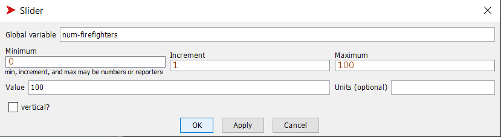
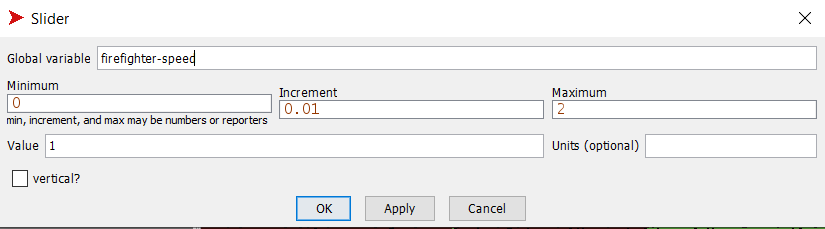
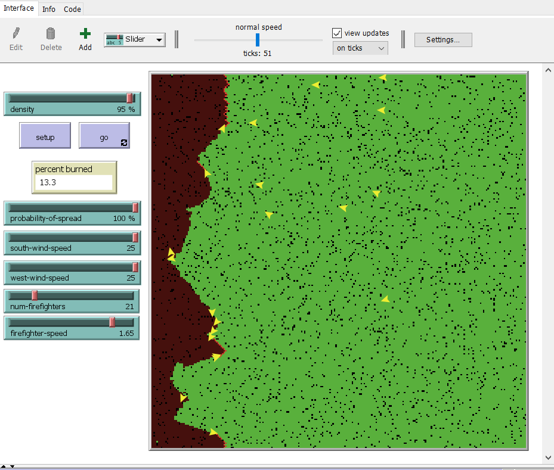
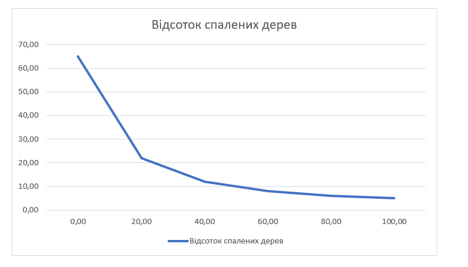

## Комп'ютерні системи імітаційного моделювання
## СПм-22-4, Самойлов Іван
### Лабораторна робота №**2**. Редагування імітаційних моделей у середовищі NetLogo

 

### Варіант 5, модель у середовищі NetLogo:
[Fire Simple Extension 2](http://www.netlogoweb.org/launch#http://www.netlogoweb.org/assets/modelslib/IABM%20Textbook/chapter%203/Fire%20Extensions/Fire%20Simple%20Extension%202.nlogo)

 

### Внесені зміни у вихідну логіку моделі, за варіантом:

**Додати агентів-"пожарних", кількість яких вказується користувачем.**

Створено новий вид агентів пожежники:
<pre>
  breed [ firefighters firefighter ]
</pre>

Створення пожежників в процедурі setup:
<pre>
  create-firefighters num-firefighters [
    let target one-of patches with [pcolor = green or pcolor = black]
    set size 7
    move-to target
    set color yellow
  ]
</pre>

Num-firefighters - це кількість пожежників, яка визначається користувачем за допомогою слайдера:

Логіка руху пожежників в процедурі go. Вони рухаються випадковим чином:
<pre>
  ask firefighters [
    let possible-moves neighbors4 with [pcolor = black or pcolor = green]
    ifelse any? possible-moves [
      rt random 60
      fd 2
      lt random-float 60
    ] [
      ifelse pcolor = red [
      ;; extinguish the fire
        set pcolor black ]
      [die]
    ]
  ]
</pre>

**При зустрічі пожарними джерел розповсюдження вогню (червоних клітинок) "гасити" їх.**

В процедурі go додано логіку тушіння пожеш пожежниками:
<pre>
      if pcolor = red [
      ;; extinguish the fire
        set pcolor green
        ask neighbors [if pcolor = red [set pcolor green] ]
      ]
</pre>

### Внесені зміни у вихідну логіку моделі, на власний розсуд:

**Додана можливість пожежникам "бачити" джерела вогню.**
Кожен пожежник обирає найближче палаюче дерево та наближається до нього. Якщо рятувальник досягає палаючого дерева на відстані не більше 5 одиниць, він гасить його, змінюючи його колір на зелений.
<pre>
   ;; move firefighters
  ask firefighters [
    let possible-moves neighbors4 with [pcolor = black or pcolor = green]
    if any? possible-moves [
      let nearest-burning-tree min-one-of patches with [pcolor = red] [distance myself]
      if nearest-burning-tree != nobody [
        face nearest-burning-tree
        fd firefighter-speed
        ;; check if firefighter is within the burning area
        if distance nearest-burning-tree <= 5 [
        ;; extinguish the fire
        set pcolor green
        ask neighbors [ if pcolor = red [ set pcolor green ] ]
        ]
      ]
    ] 
  ]
</pre>

Також додана можливість змінювати швидкість пожежників:

Фінальний код моделі та її інтерфейс доступні за [посиланням](Firefighters.nlogo).
 

## Обчислювальні експерименти 
### 1. Вплив кількості пожежників на відсоток спалених дерев
Досліджується залежність кількості спалених дерев від  кількості пожежників.
Експерименти проводяться при 0-100 пожежників, з кроком 20, усього 6 симуляцій.  
Інші керуючі параметри мають значення за замовчуванням:
- **density**: 82%
- **probability-of-spread**:57%
- **south-wind-speed**:25
- **west-wind-speed**:25
- **firefighter-speed**: 1.0
  
<table>
<thead>
<tr><th>Кількість пожежників</th><th>Відсоток спалених дерев</th></tr>
</thead>
<tbody>
<tr><td>0</td><td>65</td></tr>
<tr><td>20</td><td>22</td></tr>
<tr><td>40</td><td>12</td></tr>
<tr><td>60</td><td>8</td></tr>
<tr><td>80</td><td>6</td></tr>
<tr><td>100</td><td>5</td></tr>
</tbody>
</table>

 За даними можна побачити, що кількість пожежників має важливий вплив на відсоток спалених дерев. Зі збільшенням кількості пожежників відсоток спалених дерев зменшується. Це свідчить про ефективність дій рятувальників у стримуванні поширення пожежі.
 
